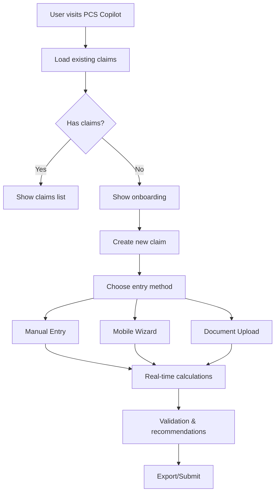
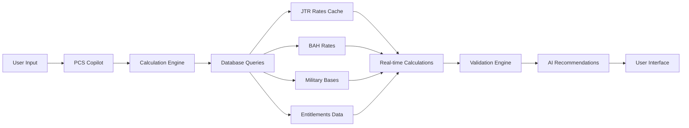

# PCS COPILOT ARCHITECTURE MAP

## 🎯 **OVERVIEW**

The PCS Copilot is Garrison Ledger's flagship tool for military Permanent Change of Station (PCS) financial planning. It's a comprehensive system that helps military members calculate entitlements, plan moves, and manage PCS claims with AI-powered assistance.

**Live URL**: `https://www.garrisonledger.com/dashboard/pcs-copilot`

---

## 🏗️ **SYSTEM ARCHITECTURE**

### **Frontend Components**
```
app/dashboard/pcs-copilot/
├── page.tsx                           # Main page component
├── EnhancedPCSCopilotClient.tsx       # Primary client component
├── [id]/
│   └── PCSClaimClient.tsx            # Individual claim management
└── planner/
    ├── page.tsx                      # Assignment planner page
    └── PCSPlannerClient.tsx          # Base comparison tool
```

### **Core Components**
```
app/components/pcs/
├── PCSManualEntry.tsx                # Manual data entry form
├── PCSDocumentUploader.tsx           # Document upload with OCR
├── PCSHelpSystem.tsx                 # Help articles and FAQ
├── PCSHelpWidget.tsx                 # AI-powered Q&A widget
├── PCSMobileInterface.tsx            # Mobile-optimized interface
├── PCSMobileWizard.tsx               # Step-by-step mobile wizard
├── PCSValidationResults.tsx          # JTR compliance validation
├── PCSRecommendationCards.tsx         # Smart recommendations
└── PCSAIExplanation.tsx             # AI explanations for flags
```

### **Backend API Routes**
```
app/api/pcs/
├── claim/route.ts                    # Create/update PCS claims
├── estimate/route.ts                 # Calculate entitlements
├── validate/route.ts                 # JTR compliance validation
├── calculate-distance/route.ts       # Distance calculations
├── documents/
│   ├── upload/route.ts               # Document upload
│   └── process/route.ts              # OCR processing
├── export/
│   ├── pdf/route.ts                  # PDF generation
│   └── excel/route.ts                # Excel generation
└── planner/
    ├── bases/route.ts                # Military bases data
    └── compare/route.ts              # Base comparison
```

---

## 🔄 **DATA FLOW ARCHITECTURE**

### **1. User Journey Flow**


### **2. Component Architecture**
```mermaid
graph TB
    subgraph "Frontend Layer"
        A[EnhancedPCSCopilotClient]
        B[PCSManualEntry]
        C[PCSDocumentUploader]
        D[PCSHelpSystem]
        E[PCSMobileInterface]
        F[Assignment Planner]
    end
    
    subgraph "API Layer"
        G[/api/pcs/estimate]
        H[/api/pcs/validate]
        I[/api/pcs/calculate-distance]
        J[/api/pcs/documents/upload]
        K[/api/pcs/export/pdf]
        L[/api/pcs/planner/bases]
    end
    
    subgraph "Data Layer"
        M[JTR Rates Cache]
        N[BAH Rates]
        O[Military Bases]
        P[PCS Claims]
        Q[Documents]
    end
    
    subgraph "AI Layer"
        R[Ask Assistant]
        S[OCR Processing]
        T[Smart Recommendations]
    end
    
    A --> G
    A --> H
    B --> G
    C --> J
    D --> R
    E --> G
    F --> L
    
    G --> M
    G --> N
    H --> M
    I --> O
    J --> S
    L --> O
    
    S --> Q
    R --> T
```

### **2. Data Sources Integration**


---

## 🧩 **COMPONENT BREAKDOWN**

### **EnhancedPCSCopilotClient.tsx** (Main Controller)
**Purpose**: Central orchestrator for the entire PCS Copilot experience

**Key Responsibilities**:
- State management for claims, views, and UI states
- User authentication and profile management
- Integration between all sub-components
- Real-time calculation coordination
- Export functionality coordination

**State Management**:
```typescript
// Core state
const [claims, setClaims] = useState<PCSClaim[]>([]);
const [currentView, setCurrentView] = useState<ViewType>("list");
const [selectedClaim, setSelectedClaim] = useState<PCSClaim | null>(null);
const [userProfile, setUserProfile] = useState<UserProfile | null>(null);

// UI state
const [showNewClaimModal, setShowNewClaimModal] = useState(false);
const [showHelp, setShowHelp] = useState(false);
const [showOnboarding, setShowOnboarding] = useState(false);
```

**Key Functions**:
- `handleCreateClaim()` - Creates new PCS claims
- `handleValidateClaim()` - Validates claims against JTR
- `handleAskQuestion()` - AI-powered help system
- `handleExportPDF()` / `handleExportExcel()` - Export functionality

### **PCSManualEntry.tsx** (Data Entry)
**Purpose**: Primary interface for manual PCS data entry

**Key Features**:
- Real-time calculation preview
- Form validation with JTR compliance
- Auto-calculation of derived fields
- Progressive form completion

**Real-time Preview System**:
```typescript
const calculateRealTimePreview = async () => {
  // Calls /api/pcs/estimate for live calculations
  // Updates preview as user types
  // Shows DLA, TLE, MALT, Per Diem totals
};
```

**Form Sections**:
1. **Basic Info**: Claim name, dates, bases, travel method
2. **Travel Details**: Rank, dependents, distance
3. **Lodging (TLE)**: Origin/destination nights and rates
4. **Weight & Distance**: Estimated/actual weight, mileage
5. **Receipts**: Fuel, lodging, meal receipts

### **PCSDocumentUploader.tsx** (OCR Processing)
**Purpose**: Document upload and OCR processing for automated data extraction

**Supported Formats**:
- Images: JPEG, PNG, WebP, TIFF
- Documents: PDF
- Max size: 10MB

**OCR Pipeline**:
```typescript
// 1. File validation and upload
// 2. Google Vision API OCR processing
// 3. Data extraction and normalization
// 4. Form population with extracted data
// 5. Validation and user confirmation
```

**Fallback System**:
- If Google API key missing → Mock OCR for testing
- If OCR fails → Manual entry fallback
- Always provides user confirmation step

### **PCSHelpSystem.tsx** (Knowledge Base)
**Purpose**: Comprehensive help system with AI-powered Q&A

**Content Structure**:
- **Getting Started**: Basic PCS Copilot usage
- **Understanding Entitlements**: DLA, TLE, MALT explanations
- **Document Requirements**: Required paperwork
- **Common Issues**: Troubleshooting guide
- **JTR Compliance**: Regulation explanations

**AI Integration**:
- Uses `/api/ask/submit` endpoint
- Context-aware responses
- Military-specific terminology
- Citation of official sources

### **PCSMobileInterface.tsx** (Mobile Optimization)
**Purpose**: Mobile-first interface for smartphone users

**Features**:
- Touch-friendly form controls
- Progressive disclosure
- Swipe navigation
- Offline capability
- Responsive design

**Mobile Wizard Flow**:
1. **Basic Info** → 2. **Travel Details** → 3. **Lodging** → 4. **Weight** → 5. **Review**

### **Assignment Planner** (Base Comparison)
**Purpose**: Compare potential duty stations before receiving orders

**Data Sources**:
- **590+ Military Bases** from database
- **14,352 BAH Rates** (2025 official)
- **300 JTR Rates** for per diem
- **Real-time calculations** for PCS costs

**Comparison Features**:
- Side-by-side base comparison
- Cost analysis (BAH, COLA, PCS costs)
- School ratings and quality of life
- Distance calculations
- Recommendation engine

---

## 🔌 **API INTEGRATION MAP**

### **Core Calculation APIs**
```typescript
// Entitlement calculations
POST /api/pcs/estimate
{
  rank: "E05",
  dependents: true,
  distance: 1200,
  perDiemDays: 5,
  tleOriginNights: 2,
  tleDestinationNights: 2
}

// Distance calculations
POST /api/pcs/calculate-distance
{
  origin: "Fort Liberty (Bragg)",
  destination: "Joint Base Lewis-McChord",
  useGoogleMaps: true
}

// JTR validation
POST /api/pcs/validate
{
  claimId: "uuid",
  validationType: "comprehensive"
}
```

### **Document Processing APIs**
```typescript
// Document upload
POST /api/pcs/documents/upload
FormData: { file, claimId }

// OCR processing
POST /api/pcs/documents/process
{
  documentId: "uuid",
  documentType: "orders"
}
```

### **Export APIs**
```typescript
// PDF generation
POST /api/pcs/export/pdf
{
  claimId: "uuid",
  type: "full"
}

// Excel generation
POST /api/pcs/export/excel
{
  claimId: "uuid",
  type: "expense_tracking"
}
```

---

## 🗄️ **DATABASE SCHEMA**

### **Core Tables**
```sql
-- PCS Claims
pcs_claims (
  id UUID PRIMARY KEY,
  user_id TEXT,
  claim_name TEXT,
  pcs_orders_date DATE,
  departure_date DATE,
  arrival_date DATE,
  origin_base TEXT,
  destination_base TEXT,
  travel_method TEXT,
  dependents_count INTEGER,
  rank_at_pcs TEXT,
  branch TEXT,
  status TEXT,
  readiness_score INTEGER,
  completion_percentage INTEGER,
  entitlements JSONB
)

-- Document storage
pcs_claim_documents (
  id UUID PRIMARY KEY,
  claim_id UUID REFERENCES pcs_claims(id),
  user_id TEXT,
  document_type TEXT,
  file_path TEXT,
  ocr_data JSONB,
  uploaded_at TIMESTAMP
)

-- Entitlement snapshots
pcs_entitlement_snapshots (
  id UUID PRIMARY KEY,
  claim_id UUID REFERENCES pcs_claims(id),
  user_id TEXT,
  calculation_data JSONB,
  calculated_at TIMESTAMP
)
```

### **Reference Data Tables**
```sql
-- JTR Rates (300 locations)
jtr_rates_cache (
  id UUID PRIMARY KEY,
  rate_type TEXT,
  rate_data JSONB,
  effective_date DATE,
  verification_status TEXT
)

-- BAH Rates (14,352 entries)
bah_rates (
  id UUID PRIMARY KEY,
  mha TEXT,
  paygrade TEXT,
  with_dependents BOOLEAN,
  rate_cents INTEGER,
  effective_date DATE
)

-- Military Bases (590+ bases)
base_external_data_cache (
  id UUID PRIMARY KEY,
  base_id TEXT,
  base_name TEXT,
  state TEXT,
  city TEXT,
  lat DECIMAL,
  lng DECIMAL,
  zip TEXT
)
```

---

## 🤖 **AI INTEGRATION**

### **Ask Assistant Integration**
```typescript
// Help system uses Ask Assistant
const handleAskQuestion = async (question: string) => {
  const response = await fetch("/api/ask/submit", {
    method: "POST",
    body: JSON.stringify({ 
      question,
      templateId: "pcs-copilot-help"
    })
  });
  // Returns military-specific, context-aware answers
};
```

### **AI-Powered Features**
1. **Smart Recommendations**: Based on claim data and JTR rules
2. **Context-Aware Help**: Military terminology and regulations
3. **Document Processing**: OCR with military document recognition
4. **Validation Explanations**: AI explanations for compliance flags

---

## 🔒 **SECURITY & AUTHENTICATION**

### **Authentication Flow**
```typescript
// Clerk integration
const { userId } = await auth();
if (!userId) throw Errors.unauthorized();

// RLS policies
// All queries use: auth.uid()::text = user_id
```

### **Data Protection**
- **RLS Policies**: All user data protected by Row Level Security
- **API Authentication**: All endpoints require valid Clerk session
- **Document Security**: Files stored with user-specific paths
- **Rate Limiting**: API endpoints protected against abuse

---

## 📱 **RESPONSIVE DESIGN**

### **Breakpoint Strategy**
```css
/* Mobile First */
@media (max-width: 768px) {
  /* Mobile wizard interface */
  /* Touch-friendly controls */
  /* Progressive disclosure */
}

@media (min-width: 769px) {
  /* Desktop interface */
  /* Multi-column layouts */
  /* Advanced features */
}
```

### **Mobile Optimizations**
- **Touch Targets**: Minimum 44px touch areas
- **Swipe Navigation**: Left/right swipe between steps
- **Offline Support**: Cached calculations and data
- **Progressive Web App**: Installable on mobile devices

---

## 🚀 **PERFORMANCE OPTIMIZATIONS**

### **Loading States**
```typescript
// Centralized loading state management
const loadingStates = usePCSLoadingStates();

// Usage
loadingStates.startLoading("calculation", "calculate", "Calculating...");
// ... async operation
loadingStates.stopLoading("calculation");
```

### **Caching Strategy**
- **Database Queries**: Cached for 30 days
- **Calculations**: Snapshot system for repeat access
- **Static Data**: BAH/JTR rates cached locally
- **API Responses**: Intelligent caching with TTL

### **Real-time Updates**
- **Live Calculations**: Updates as user types
- **Debounced API Calls**: Prevents excessive requests
- **Optimistic UI**: Immediate feedback with rollback

---

## 🧪 **TESTING STRATEGY**

### **Unit Tests**
```typescript
// Calculation engine tests
__tests__/pcs-copilot/calculations.test.ts

// Test coverage for:
// - Entitlement calculations
// - Distance calculations
// - JTR compliance validation
// - Error handling
```

### **Integration Tests**
- **API Endpoint Testing**: All routes tested
- **Database Integration**: Query performance validation
- **Authentication Flow**: Clerk integration testing
- **Export Functionality**: PDF/Excel generation testing

---

## 🔧 **MAINTENANCE GUIDELINES**

### **For Future Agents**

#### **Adding New Features**
1. **Follow Type Safety**: Use proper TypeScript types
2. **Maintain RLS**: All database queries must use RLS policies
3. **Test Calculations**: Verify against official JTR rates
4. **Mobile First**: Ensure mobile compatibility
5. **Document Changes**: Update this architecture map

#### **Common Issues & Solutions**
```typescript
// Issue: Type mismatches
// Solution: Use proper union types
const handleData = (data: Record<string, unknown> | FormData) => {};

// Issue: Missing authentication
// Solution: Always check auth first
const { userId } = await auth();
if (!userId) throw Errors.unauthorized();

// Issue: Database connection errors
// Solution: Use supabaseAdmin for server-side operations
const { data, error } = await supabaseAdmin.from("table").select("*");
```

#### **Data Updates**
- **BAH Rates**: Update annually from DFAS
- **JTR Rates**: Update quarterly from DTMO
- **Military Bases**: Update when bases open/close/rename
- **All updates**: Must maintain backward compatibility

---

## 📊 **MONITORING & ANALYTICS**

### **Key Metrics**
- **Calculation Accuracy**: Compare against official sources
- **User Completion Rate**: Track claim completion percentage
- **Error Rates**: Monitor validation failures
- **Performance**: API response times and build times

### **Error Handling**
```typescript
// Centralized error handling
try {
  // Operation
} catch (error) {
  logger.error("PCS operation failed:", error);
  // Graceful fallback
  // User notification
  // Error reporting
}
```

---

## 🎯 **SUCCESS CRITERIA**

### **User Experience**
- ✅ **Intuitive Interface**: Military members can use without training
- ✅ **Accurate Calculations**: Matches official JTR calculations
- ✅ **Fast Performance**: Sub-3 second load times
- ✅ **Mobile Optimized**: Works perfectly on smartphones

### **Technical Excellence**
- ✅ **Zero TypeScript Errors**: Clean compilation
- ✅ **100% RLS Coverage**: All data properly secured
- ✅ **Comprehensive Testing**: Unit and integration tests
- ✅ **Production Ready**: Handles edge cases gracefully

---

## 🔮 **FUTURE ENHANCEMENTS**

### **Planned Features**
- **Real-time Collaboration**: Multiple users on same claim
- **Advanced Analytics**: PCS cost trends and insights
- **Integration APIs**: Connect with military systems
- **AI Predictions**: Forecast PCS costs and timelines

### **Technical Debt**
- **Linting Issues**: 585 warnings to address (non-critical)
- **Performance**: Optimize large dataset queries
- **Accessibility**: Enhance WCAG compliance
- **Documentation**: Expand API documentation

---

**This architecture map should be updated whenever significant changes are made to the PCS Copilot system. It serves as the single source of truth for understanding how this complex system works together.**

---

## 🚀 **QUICK REFERENCE FOR FUTURE AGENTS**

### **🔧 Common Tasks & Solutions**

#### **Adding a New Calculation Type**
```typescript
// 1. Add to calculation-engine.ts
export interface NewCalculationType {
  // Define the calculation structure
}

// 2. Add to API endpoint
POST /api/pcs/estimate
{
  // Include new calculation parameters
}

// 3. Update frontend component
const calculateNewType = async (data: FormData) => {
  // Call API and update UI
};
```

#### **Adding a New Document Type**
```typescript
// 1. Update document types
type DocumentType = 'orders' | 'weigh_ticket' | 'lodging_receipt' | 'fuel_receipt' | 'meal_receipt' | 'new_type';

// 2. Add OCR processing logic
function processNewDocumentType(ocrData: any) {
  // Extract relevant fields
}

// 3. Update validation rules
const validateNewDocumentType = (data: any) => {
  // Add validation logic
};
```

#### **Adding a New Base**
```typescript
// 1. Add to military-bases.json
{
  "id": "new-base-id",
  "name": "New Base Name",
  "branch": "Army",
  "state": "TX",
  "city": "City",
  "lat": 29.7604,
  "lng": -95.3698,
  "zip": "77001"
}

// 2. Update base_external_data_cache table
INSERT INTO base_external_data_cache (base_id, base_name, state, city, lat, lng, zip)
VALUES ('new-base-id', 'New Base Name', 'TX', 'City', 29.7604, -95.3698, '77001');

// 3. Test assignment planner
// Bases should appear automatically in dropdown
```

### **🐛 Common Issues & Debugging**

#### **"Calculation not updating"**
```typescript
// Check real-time preview function
const calculateRealTimePreview = async () => {
  // Ensure all required fields are present
  if (!formData.rank_at_pcs || !formData.dependents_count || !formData.malt_distance) {
    return; // Missing required data
  }
  
  // Check API response
  const response = await fetch("/api/pcs/estimate", {
    method: "POST",
    body: JSON.stringify({
      rank: formData.rank_at_pcs,
      dependents: formData.dependents_count > 0,
      distance: formData.malt_distance,
      // ... other fields
    })
  });
};
```

#### **"Help system not responding"**
```typescript
// Check AI endpoint
const handleAskQuestion = async (question: string) => {
  try {
    const response = await fetch("/api/ask/submit", {
      method: "POST",
      headers: { "Content-Type": "application/json" },
      body: JSON.stringify({ 
        question,
        templateId: "pcs-copilot-help" // Must match template
      }),
    });
    
    if (!response.ok) {
      console.error("Ask Assistant error:", response.status);
    }
  } catch (error) {
    console.error("Failed to ask question:", error);
  }
};
```

#### **"Assignment planner showing limited bases"**
```typescript
// Check bases API endpoint
const loadBases = async () => {
  try {
    const response = await fetch("/api/pcs/planner/bases");
    if (response.ok) {
      const data = await response.json();
      setAvailableBases(data.bases || []); // Should have 590+ bases
    } else {
      console.error("Failed to load bases:", response.status);
      // Falls back to hardcoded bases
    }
  } catch (error) {
    console.error("Failed to load bases:", error);
  }
};
```

### **📊 Data Verification Commands**

#### **Check Database Health**
```sql
-- Verify BAH rates (should be 14,352)
SELECT COUNT(*) FROM bah_rates WHERE effective_date = '2025-01-01';

-- Verify JTR rates (should be 300)
SELECT COUNT(*) FROM jtr_rates_cache WHERE rate_type = 'per_diem';

-- Verify military bases (should be 590+)
SELECT COUNT(*) FROM base_external_data_cache WHERE base_id IS NOT NULL;

-- Check recent PCS claims
SELECT COUNT(*) FROM pcs_claims WHERE created_at > NOW() - INTERVAL '7 days';
```

#### **Test API Endpoints**
```bash
# Test calculation endpoint
curl -X POST "https://www.garrisonledger.com/api/pcs/estimate" \
  -H "Content-Type: application/json" \
  -d '{"rank": "E05", "dependents": true, "distance": 1200}'

# Test distance calculation
curl -X POST "https://www.garrisonledger.com/api/pcs/calculate-distance" \
  -H "Content-Type: application/json" \
  -d '{"origin": "Fort Liberty (Bragg)", "destination": "Joint Base Lewis-McChord"}'

# Test bases endpoint
curl -X GET "https://www.garrisonledger.com/api/pcs/planner/bases"
```

### **🔒 Security Checklist**

#### **Before Any Changes**
- [ ] All database queries use RLS policies
- [ ] API endpoints check authentication
- [ ] No sensitive data in logs
- [ ] Environment variables not committed
- [ ] TypeScript compilation passes
- [ ] Mobile responsiveness maintained

#### **After Changes**
- [ ] Test on mobile devices
- [ ] Verify calculation accuracy
- [ ] Check export functionality
- [ ] Validate help system responses
- [ ] Update this architecture map

### **📈 Performance Monitoring**

#### **Key Metrics to Watch**
```typescript
// API response times
const startTime = Date.now();
const response = await fetch("/api/pcs/estimate");
const duration = Date.now() - startTime;
// Should be < 2 seconds

// Calculation accuracy
const officialRate = 1500; // From DFAS
const calculatedRate = await calculateBAH(rank, location);
const accuracy = Math.abs(calculatedRate - officialRate) / officialRate;
// Should be < 1% variance
```

#### **Error Monitoring**
```typescript
// Track calculation errors
try {
  const result = await calculateEntitlements(data);
} catch (error) {
  logger.error("Calculation failed:", {
    error: error.message,
    data: sanitizedData,
    userId: userId
  });
}

// Track validation failures
const validationFlags = await validateClaim(claimData);
if (validationFlags.some(flag => flag.severity === 'error')) {
  logger.warn("Validation errors found:", validationFlags);
}
```

---

## 📚 **RESOURCES FOR FUTURE AGENTS**

### **Official Military Sources**
- **DFAS**: https://www.dfas.mil/ - Official pay rates and BAH
- **DTMO**: https://www.defensetravel.dod.mil/ - Per diem rates and JTR
- **JTR**: Joint Travel Regulations - Official PCS rules
- **DFAS BAH Calculator**: https://www.travel.dod.mil/Allowances/Basic-Allowance-for-Housing/

### **Technical Documentation**
- **Next.js App Router**: https://nextjs.org/docs/app
- **Supabase RLS**: https://supabase.com/docs/guides/auth/row-level-security
- **Clerk Authentication**: https://clerk.com/docs
- **TypeScript Best Practices**: https://typescript-eslint.io/rules/

### **Garrison Ledger Specific**
- **SSOT**: `lib/ssot.ts` - Single source of truth for all constants
- **Military Audience Guide**: `docs/MILITARY_AUDIENCE_GUIDE.md`
- **Data Sources Reference**: `docs/DATA_SOURCES_REFERENCE.md`
- **System Status**: `SYSTEM_STATUS.md` - Current system state

---

**This architecture map should be updated whenever significant changes are made to the PCS Copilot system. It serves as the single source of truth for understanding how this complex system works together.**
